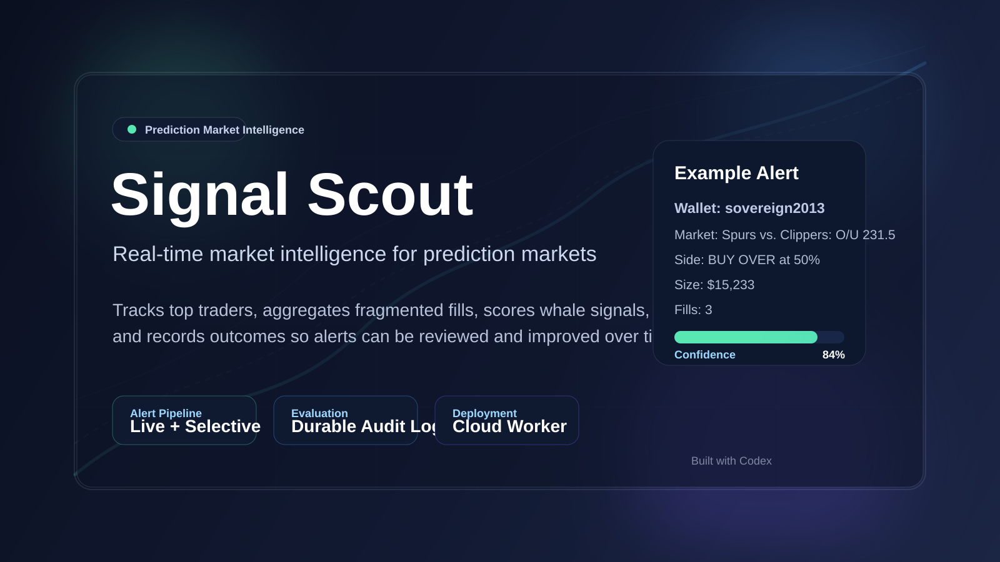

# Signal Scout

**A self-evaluating market-intelligence pipeline for prediction markets.**



Signal Scout monitors public trade activity, aggregates fragmented fills into coherent
position events, filters noise, sends selective alerts, and records the evidence needed to
evaluate whether those alerts held up over time.

This project was built as a decision-support system. The goal is to turn raw trade flow into structured, testable signals.

> [!IMPORTANT]
> Signal Scout is an educational research project, not financial advice or an automated
> trading system. It does not place trades or manage funds.

## What It Does

- Tracks top Polymarket traders from the public leaderboard
- Pulls recent public trades for those traders in live mode
- Aggregates split fills into meaningful position events
- Scores trades using:
  - wallet quality
  - trade size
  - market context
  - price movement
  - trade clustering
  - inferred trade intent
- Sends phone alerts for whale-sized, high-confidence signals
- Writes a durable audit trail for every alert and ignored trade
- Persists a server-side evaluation sidecar so the system can later determine whether alerts were right or wrong

## Why It Exists

Prediction markets are noisy. Serious traders can make thousands of small executions, and most of that activity is not useful on its own.

Signal Scout is designed to answer a more valuable question:

`Which trades are meaningful enough to deserve attention right now, and do those signals actually hold up over time?`

## Architecture

Signal Scout has three layers:

1. Detect
   - ingest live public trade activity from Polymarket
   - track leaderboard traders

2. Filter
   - aggregate fragmented fills
   - score events by quality, size, timing, and context

3. Evaluate
   - store every decision in an audit log
   - persist server-side follow-through and resolved-outcome evaluations
   - generate an offline report for reviewing signal quality

```text
Public market APIs
       |
       v
Detect and aggregate fills
       |
       v
Score and filter signals
       |---------------------> Notification output
       v
Audit log and evaluation sidecar
       |
       v
Offline HTML performance report
```

## Repository Guide

- [`bot.py`](bot.py)
  - live worker
  - scoring logic
  - aggregation
  - notifications
  - persistent audit/evaluation logging

- [`analyze_audit.py`](analyze_audit.py)
  - builds the HTML report from the audit log and evaluation sidecar

- [`fly.toml`](fly.toml)
  - Fly deployment configuration

## Quick Start

Signal Scout uses only the Python standard library.

```bash
git clone https://github.com/AlexHess123/signal-scout.git
cd signal-scout
python3 bot.py --mode simulate --notify-via stdout --max-events 10
```

The simulation mode generates synthetic trades and does not require credentials or network
access. To inspect a newline-delimited event file instead:

```bash
python3 bot.py --mode jsonl --events-file events.jsonl --notify-via stdout
```

## Deployment

The app is deployed as a single Fly worker with a mounted volume for persistent data.

Persistent files on the worker:

- `/data/trade_audit.jsonl`
- `/data/trade_audit_evaluations.jsonl`

Notification credentials are supplied only through runtime environment variables. They are never
required for simulation and must not be committed to Git or passed on the command line, where they
could be exposed through shell history or the operating-system process list.

- Pushover: `PUSHOVER_APP_TOKEN` and `PUSHOVER_USER_KEY`
- ntfy: `NTFY_TOPIC`

Custom ntfy servers must use an HTTPS URL supplied through `--ntfy-url`.

## Validation

The repository uses only the Python standard library at runtime. Development checks are pinned in
`requirements-dev.txt`:

```bash
python3 -m pip install -r requirements-dev.txt
ruff check .
bandit -q -ll -r bot.py analyze_audit.py
python3 -m unittest discover -s tests -v
python3 bot.py --mode simulate --notify-via stdout --max-events 10
```

To build the local HTML evaluation report after generating an audit log:

```bash
python3 analyze_audit.py
```

## Alert Philosophy

This system is intentionally selective.

It is designed to alert on:

- large trades
- high-confidence signals
- top-trader activity
- unusual clustered behavior

It is not designed to forward every trade.

## Evaluation

Signal Scout records:

- alerts
- ignored trades
- confidence score
- reasons
- sizes
- fills
- wallet identity
- market context

It also writes an evaluation sidecar that grades alerts later using:

- short-horizon follow-through
- resolved market outcomes when available

That makes the project a self-auditing intelligence system rather than a one-way notification script.

## Limitations

- Historical alerts recorded before the `market_lookup_slug` fix are harder to resolve cleanly.
- Evaluation quality depends on market data availability and enough time passing for markets to resolve.
- The current report is strongest on post-fix records that include the correct lookup slug.
- Public API availability, schema changes, and rate limits can affect live collection.
- A strong historical signal does not guarantee future performance.

## Security and Privacy

- No API keys or notification credentials are stored in the repository.
- Notification credentials are environment-only and never accepted as command-line arguments.
- Generated audit logs and reports are excluded from Git.
- Live mode refuses the insecure-SSL override.
- User-configurable endpoints must use HTTPS, and outbound requests have explicit time limits.
- Simulation is the recommended way to review the project safely.
- Audit records can contain public wallet identifiers and market activity; generated records
  should still be treated as operational data and reviewed before sharing.
